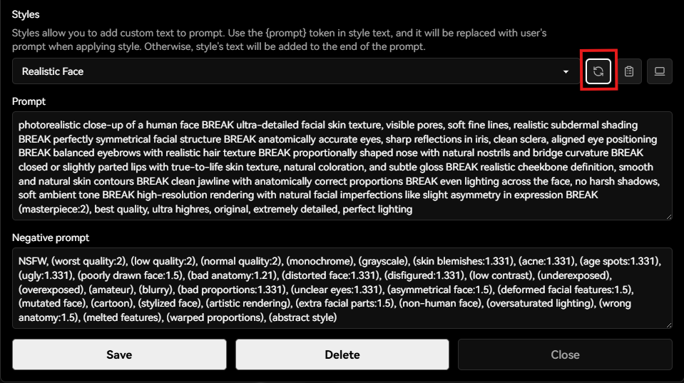

# Styles.csv for `AUTOMATIC1111/stable-diffusion-webui`

## 📖 Table of Contents
- [⚠️ Warning!](#️-warning)
- [🚀 Installation and Usage](#-installation-and-usage)
- [Other Collections (Not Created by Me)](#other-collections-not-created-by-me)
    - [How to Use My Collection](#how-to-use-my-collection)
- [Other Files](#other-files)

Welcome to my `styles.csv` project for Stable Diffusion! This is a personal initiative where I curate and maintain a comprehensive list of styles to enhance your creative workflows. The file is currently in work in progress, and I am continuously updating it to ensure it remains relevant and useful. Stay tuned for future improvements and additions as I refine this resource over time.

## ⚠️ Warning!
This file is specifically designed for Stable Diffusion 1.5 (SD1.5). I am not responsible for any issues or incompatibilities that may arise when using it with other Stable Diffusion models.

PS: I was tired of relying on styles.csv files created by others. While they worked to some extent, I wanted something tailored to my own preferences and creative vision. This project is my attempt to build a resource that truly reflects my needs and artistic goals.

## 🚀 Installation and Usage
### Step-by-Step Installation Guide

1. **Download the File**  
    Click [here](/styles.csv) to download the latest version (might not be stable) of `styles.csv`. Save it to a location on your computer where you can easily find it.

2. **Locate Your Stable Diffusion Folder**  
    Find the folder where your Stable Diffusion installation is located. This is typically the folder where you run the Stable Diffusion software.

3. **Copy the File**  
    Move the downloaded `styles.csv` file into the appropriate directory within your Stable Diffusion folder. Usually, this will be the parent directory, where the `AUTOMATIC1111/stable-diffusion-webui` is installed.

4. **Install Lora (Optional)**  
    Install the LORAs and other files, for the best efefcts
    Could be found in 

5. **Refresh Styles**  
    In the Stable Diffusion WebUI, go to the style selector drop down. There must be a pen icon (or something like that), click on it, the Styles menu would appear and on the Styles menu, just click on the refresh button to refresh your styles.
    

6. **Select a Style**  
    Open the Stable Diffusion interface, and you should now see the styles from `styles.csv` available for use. Simply select a style and start creating!

If you encounter any issues, feel free to reach out for support.

## Other Collections (Not Created by Me)
If you need a quick, ready-to-use CSV file as an alternative to my curated version, here are some options I found online with minor adjustments. While they may not be as polished, they can serve as a temporary solution while I continue improving my detailed `styles.csv`.
- Extensive Style Collection: [ref.csv](src/csv/ref.csv)
- AI generated and merged version: [test.csv](src/csv/test.csv)

### How to Use My Collection
1. Download the CSV file you want to use.

2. Rename the file to `styles.csv`.

3. Place it in the parent directory of your `AUTOMATIC1111/stable-diffusion-webui` installation.

4. Refresh the styles in the WebUI and enjoy!

## Other Files
As you may have noticed, some prompts include LorAs and textual inversion embeddings. To download these, please visit [dependencies.md](src/pages/dependencies.md).  
They aren't exactly dependencies, but you get the idea.